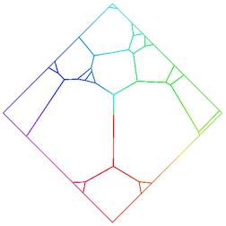
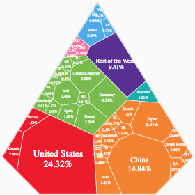
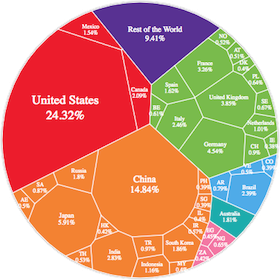

# d3-voronoi-treemap

This D3 plugin produces a _Voronoï treemap_. Given a convex polygon and nested weighted data, it tesselates/partitions the polygon in several inner cells which represent the hierarchical structure of your data, such that the area of a cell represents the weight of the underlying datum.

Because a picture is worth a thousand words:






Available only for **d3 v4**, **d3 v5** and **d3 v6**.

If you're interested on one-level map, take a look at the [d3-voronoi-map](https://github.com/Kcnarf/d3-voronoi-map) plugin, which may be simpler to use (no need of a d3-hierarchy).

## Context

D3 already provides a [d3-treemap](https://github.com/d3/d3-hierarchy/blob/master/README.md#treemap) module which produces a rectangular treemap. Such treemaps could be distorted to fit shapes that are not rectangles (cf. [Distorded Treemap - d3-shaped treemap](http://bl.ocks.org/Kcnarf/976b2e854965eea17a7754517043b91f)).

This plugin allows to compute a treemap with a unique look-and-feel, where inner areas are not strictly aligned each others, and where the outer shape can be any hole-free convex polygons (squares, rectangles, pentagon, hexagon, ... any regular convex polygon, and also any non regular hole-free convex polygon).

The drawback is that the computation of a Voronoï treemap is based on a iteration/looping process. Hence, it requires _some times_, depending on the number and type of data/weights, the desired representativeness of cell areas.

## Examples

- Real life use cases
  - [https://unearthed.greenpeace.org/2020/02/20/pesticides-croplife-hazardous-bayer-syngenta-health-bees/] by Nadieh Bremer for Greenpeace (more details at https://www.visualcinnamon.com/portfolio/highly-hazardous-pesticides)
  - [Brussels. A lovely Melting-Pot.](http://brussels-diversity.jetpack.ai/) by Karim Douieb, with a really great animation that clearly and easily explains to the reader how to read/understand the Voronoï treemap
  - [Earth's Land Surface](https://public.tableau.com/profile/luca7027#!/vizhome/EarthsLandSurfaceAVoronoiWorld/EarthsLandSurfaceAVoronoiWorld) by Luca Urzì in Tableau
- Examples with available code
  - [The Global Economy by GDP](https://bl.ocks.org/Kcnarf/fa95aa7b076f537c00aed614c29bb568), a remake of [HowMuch.net's article](https://howmuch.net/articles/the-global-economy-by-GDP)

## Installing

If you use NPM, `npm install d3-voronoi-treemap`. Otherwise, load `https://rawcdn.githack.com/Kcnarf/d3-voronoi-treemap/v1.1.2/build/d3-voronoi-treemap.js` (or its `d3-voronoi-treemap.min.js` version) to make it available in AMD, CommonJS, or vanilla environments. In vanilla, you must load the [d3-weighted-voronoi](https://github.com/Kcnarf/d3-weighted-voronoi) and [d3-voronoi-map](https://github.com/Kcnarf/d3-voronoi-map) plugins prioir to this one, and a d3 global is exported:

```html
<script src="https://d3js.org/d3.v6.min.js"></script>
<script src="https://rawcdn.githack.com/Kcnarf/d3-weighted-voronoi/v1.1.3/build/d3-weighted-voronoi.js"></script>
<script src="https://rawcdn.githack.com/Kcnarf/d3-voronoi-map/v2.1.1/build/d3-voronoi-map.js"></script>
<script src="https://rawcdn.githack.com/Kcnarf/d3-voronoi-treemap/v1.1.2/build/d3-voronoi-treemap.js"></script>
<script>
  var voronoiTreemap = d3.voronoiTreemap();
</script>
```

If you're interested in the latest developments, you can use the master build, available throught:

```html
<script src="https://raw.githack.com/Kcnarf/d3-voronoi-treemap/master/build/d3-voronoi-treemap.js"></script>
```

## TL;DR;

In your javascript, in order to define the tessellation:

```javascript
function weightAccessor(d) {
  return d.weight; // computes the weight of one of your data; depending on your data, it may be 'd.area', or 'd.percentage', ...
}
var rootNode = d3.hierarchy(nestedData); // a d3-hierarchy of your nested data
rootNode.sum(weightAccessor); // assigns the adequate weight to each node of the d3-hierarchy

var voronoiTreemap = d3.voronoiTreemap().clip([
  [0, 0],
  [0, height],
  [width, height],
  [width, 0],
]); // sets the clipping polygon
voronoiTreemap(rootNode); // computes the weighted Voronoi tessellation of the d3-hierarchy; assigns a 'polygon' property to each node of the hierarchy
```

Then, later in your javascript, in order to draw cells:

```javascript
var allNodes = rootNode.descendants();
d3.selectAll('path')
  .data(allNodes)
  .enter()
  .append('path')
  .attr('d', function (d) {
    // d is a node
    return d3.line()(d.polygon) + 'z'; // d.polygon is the computed Voronoï cell encoding the relative weight of your underlying original data
  })
  .style('fill', function (d) {
    return fillScale(d.data); // d.data is your original data
  });
```

## Reference

- based on [Computing Voronoï Treemaps - Faster, Simpler, and Resolution-independent ](https://www.uni-konstanz.de/mmsp/pubsys/publishedFiles/NoBr12a.pdf)
- [https://github.com/ArlindNocaj/power-voronoi-diagram](https://github.com/ArlindNocaj/power-voronoi-diagram) for a Java implementation

## API

<a name="voronoiTreemap" href="#voronoiTreemap">#</a> d3.<b>voronoiTreemap</b>()

Creates a new voronoiTreemap with the default configuration values and functions ([_clip_](#voronoiTreemap_clip), [_extent_](#voronoiTreemap_extent), [_size_](#voronoiTreemap_size), [_convergenceRatio_](#voronoiTreemap_convergenceRatio), [_maxIterationCount_](#voronoiTreemap_maxIterationCount), [_minWeightRatio_](#voronoiTreemap_minWeightRatio) and [_prng_](#voronoiTreemap_prng)).

<a name="_voronoiTreemap" href="#_voronoiTreemap">#</a> <i>voronoiTreemap</i>(<i>root</i>)

Computes the **Voronoï treemap** for the specified [d3-hierarchy](https://github.com/d3/d3-hierarchy#hierarchy), where _root_ is the root node of the hierarchy, assigning a _polygon_ property on the root and its descendants. A polygon is represented as an array of points \[_x_, _y_\] where _x_ and _y_ are the point coordinates, a _site_ field that refers to its site (ie. with x, y and weight retrieved from the original data), and a _site.originalObject_ field that refers to the corresponding element in _data_. Polygons are open: they do not contain a closing point that duplicates the first point; a triangle, for example, is an array of three points. Polygons are also counterclockwise (assuming the origin ⟨0,0⟩ is in the top-left corner).

As others d3-hierarchy layouts (rectangular treemap, or circle packing), the Voronoï treemap layout considers the weight of a node to be the _value_ propertyof that node. Hence, you **must** call [root.sum](https://github.com/d3/d3-hierarchy#node_sum) before passing the hierarchy to the Voronoï treemap layout, in order to properly set the _value_ property of each node (root, intermediates and leaves). For example, considering that your original nested data have leaves with a _weight_ property, you must use `rootNode.sum(function(d){ return d.weight; })`.

<a name="voronoiTreemap_clip" href="#voronoiTreemap_clip">#</a> <i>voronoiTreemap</i>.<b>clip</b>([<i>clip</i>])

If _clip_ is specified, sets the clipping polygon, , compute the adequate [_extent_](#voronoiTreemap_extent) and [_size_](#voronoiTreemap_size), and returns this layout . _clip_ defines a hole-free convex polygon, and is specified as an array of 2D points \[x, y\], which must be _(i)_ open (no duplication of the first D2 point) and _(ii)_ counterclockwise (assuming the origin ⟨0,0⟩ is in the top-left corner). If _clip_ is not specified, returns the current clipping polygon, which defaults to:

```js
[
  [0, 0],
  [0, 1],
  [1, 1],
  [1, 0],
];
```

<a name="voronoiTreemap_extent" href="#voronoiTreemap_extent">#</a> <i>voronoiTreemap</i>.<b>extent</b>([<i>extent</i>])

If _extent_ is specified, it is a convenient way to define the clipping polygon as a rectangle. It sets the extent, computes the adequate [_clip_](#voronoiTreemap_clip)ping polygon and [_size_](#voronoiTreemap_size), and returns this layout. _extent_ must be a two-element array of 2D points \[x, y\], which defines the clipping polygon as a rectangle with the top-left and bottom-right corners respectively set to the first and second points (assuming the origin ⟨0,0⟩ is in the top-left corner on the screen). If _extent_ is not specified, returns the current extent, which is `[[minX, minY], [maxX, maxY]]` of current clipping polygon, and which defaults to:

```js
[
  [0, 0],
  [1, 1],
];
```

<a name="voronoiTreemap_size" href="#voronoiTreemap_size">#</a> <i>voronoiTreemap</i>.<b>size</b>([<i>size</i>])

If _size_ is specified, it is a convenient way to define the clipping polygon as a rectangle. It sets the size, computes the adequate [_clip_](#voronoiTreemap_clip)ping polygon and [_extent_](#voronoiTreemap_extent), and returns this layout. _size_ must be a two-element array of numbers `[width, height]`, which defines the clipping polygon as a rectangle with the top-left corner set to `[0, 0]` and the bottom-right corner set to `[width, height]` (assuming the origin ⟨0,0⟩ is in the top-left corner on the screen). If _size_ is not specified, returns the current size, which is `[maxX-minX, maxY-minY]` of current clipping polygon, and which defaults to:

```js
[1, 1];
```

<a name="voronoiTreemap_convergenceRatio" href="#voronoiTreemap_convergenceRatio">#</a> <i>voronoiTreemap</i>.<b>convergenceRatio</b>([<i>convergenceRatio</i>])

If _convergenceRatio_ is specified, sets the convergence ratio, which stops computation when (cell area errors / ([_clip_](#voronoiTreemap_clip)-ping polygon area) <= _convergenceRatio_. If _convergenceRatio_ is not specified, returns the current _convergenceRatio_ , which defaults to:

```js
var convergenceRatio = 0.01; // stops computation when cell area error <= 1% clipping polygon's area
```

The smaller the _convergenceRatio_, the more representative is the treemap, the longer the computation takes time.

<a name="voronoiTreemap_maxIterationCount" href="#voronoiTreemap_maxIterationCount">#</a> <i>voronoiTreemap</i>.<b>maxIterationCount</b>([<i>maxIterationCount</i>])

If _maxIterationCount_ is specified, sets the maximum allowed number of iterations, which stops computation when it is reached, even if the [_convergenceRatio_](#voronoiTreemap_convergenceRatio) is not reached. If _maxIterationCount_ is not specified, returns the current _maxIterationCount_ , which defaults to:

```js
var maxIterationCount = 50;
```

If you want to wait until computation stops _only_ when the [_convergenceRatio_](#voronoiTreemap_convergenceRatio) is reached, just set the _maxIterationCount_ to a large amount. Be warned that computation may take a huge amount of time, due to flickering behaviours in later iterations.

<a name="voronoiTreemap_minWeightRatio" href="#voronoiTreemap_minWeightRatio">#</a> <i>voronoiTreemap</i>.<b>minWeightRatio</b>([<i>minWeightRatio</i>])

If _minWeightRatio_ is specified, sets the minimum weight ratio, which allows to compute the minimum allowed weight (_= maxWeight \* minWeightRatio_). If _minWeightRatio_ is not specified, returns the current _minWeightRatio_ , which defaults to:

```js
var minWeightRatio = 0.01; // 1% of maxWeight
```

_minWeightRatio_ allows to mitigate flickerring behaviour (caused by too small weights), and enhances user interaction by not computing near-empty cells.

<a name="voronoiTreemap_prng" href="#voronoiTreemap_prng">#</a> <i>voronoiTreemap</i>.<b>prng</b>([<i>prng</i>])

If _prng_ is specified, sets the pseudorandom number generator which is used when randomness is required (i.e. when setting intial random position of data/seeds). The given pseudorandom number generator must implement the same interface as `Math.random` and must only return values in the range [0, 1). If _prng_ is not specified, returns the current _prng_ , which defaults to `Math.random`.

Considering the same set of data, severall Voronoï treemap computations lead to disctinct final arrangements, due to the non-seedable `Math.random` number generator. If _prng_ is set to a _seedable_ PRNG which produces repeatable results, then several computations will produce the exact same final arrangement. This is useful if you want the same arrangement for distinct page loads/reloads. For example, using [seedrandom](https://github.com/davidbau/seedrandom):

```js
<script src="//cdnjs.cloudflare.com/ajax/libs/seedrandom/2.4.3/seedrandom.min.js"></script>
<script>
  var mySeededPrng = new Math.seedrandom('my seed'); // (from seedrandom's doc) Use "new" to create a local prng without altering Math.random
  voronoiTreemap.prng(mySeededPrng);
</script>
```

You can also take a look at [d3-random](https://github.com/d3/d3-random) for random number generator from other-than-uniform distributions.

## Dependencies

- d3-voronoi-map.voronoiMap

## Semantic Versioning

d3-voronoi-treemap attempts to follow [semantic versioning](https://semver.org) and
bump major version only when backwards incompatible changes are released.
